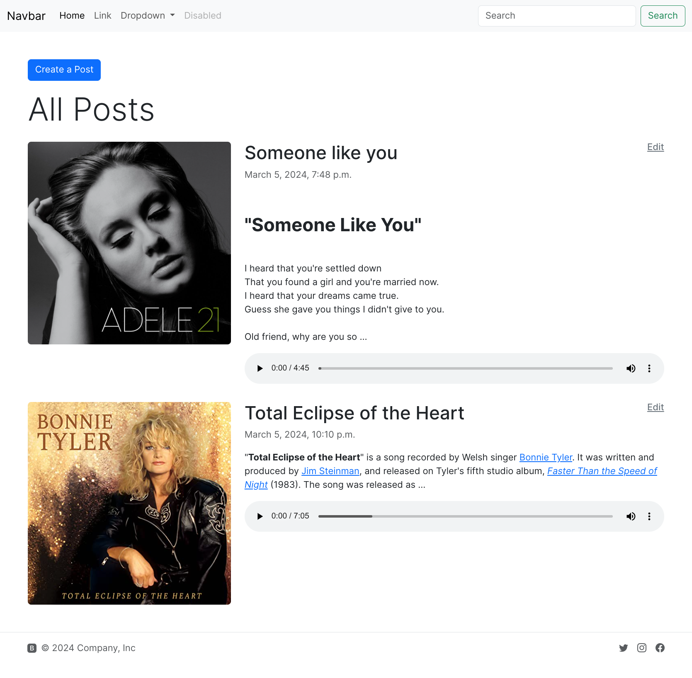
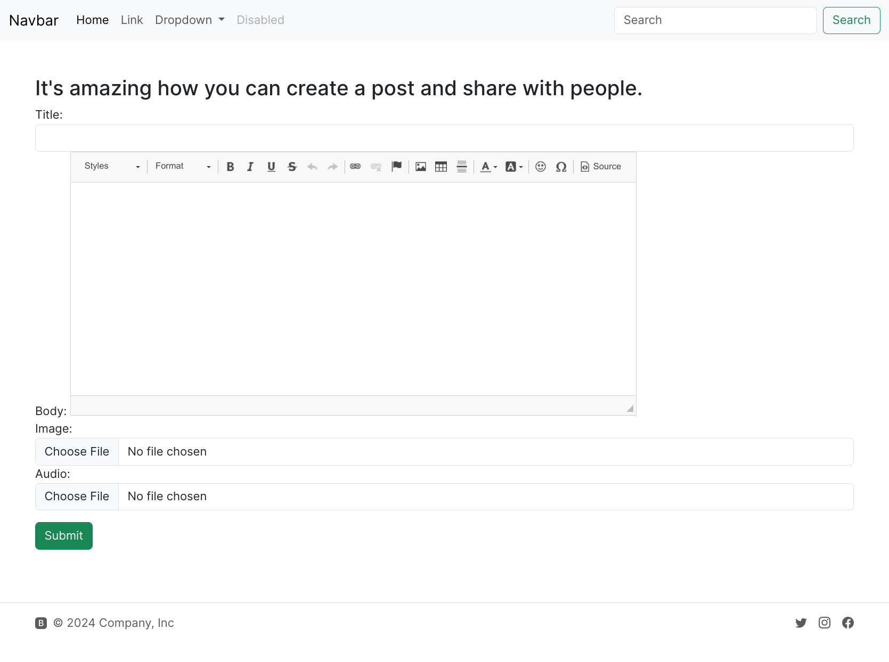
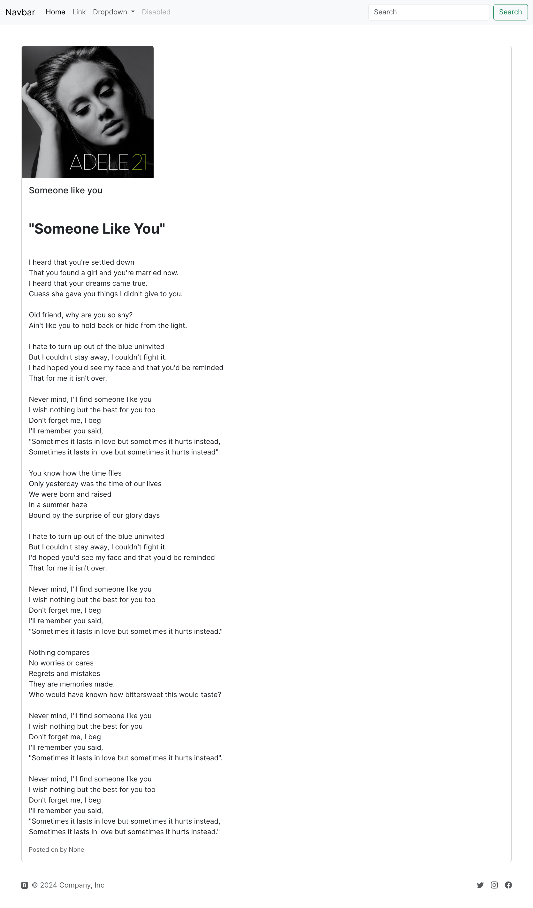

# post_project

## Table of Contents

- [Prerequisites](#prerequisites)
- [Getting Started](#getting-started)
    - [Cloning the Repository](#cloning-the-repository)
    - [Setting Up a Virtual Environment](#setting-up-a-virtual-environment)
    - [Activating the Virtual Environment](#activating-the-virtual-environment)
    - [Installing Django](#installing-django)
    - [Installing Dependencies](#installing-dependencies)
    - [Running the Project](#running-the-project)
- [Demo](#demo)
## Prerequisites

- Python 3.10+
- Git
- pip (Python package installer)
- virtualenv (Python environment builder)

## Getting Started

These instructions will get you a copy of the project up and running on your local machine for development and testing
purposes.

### Cloning the Repository

To clone this repository, open a command prompt (cmd) or PowerShell and navigate to the directory where you want the
project to be saved. Then run the following command:

```bash
git clone https://github.com/ducchinhpro123/post-app.git
```

### Setting Up a Virtual Environment

Navigate into the project directory and create a new virtual environment:

```bash
cd post-app
python -m venv env
```

### Setting Up a Virtual Environment

Activate the virtual environment:  On Windows:

```bash
env\Scripts\activate
```

### Install Django

With the virtual environment activated, you can install Django:

```bash
pip install django
```

### Installing Dependencies

To install the project's dependencies, run the following command:

```bash
pip install -r requirements.txt
```


### Make Migrations

Before running project, make sure to run the following command to make migrations:

```bash
python manage.py makemigrations
python manage.py migrate
```

### Running the Project

To run the project, navigate to the `post_project` directory and run the following command:

```bash
python manage.py runserver
```

The project will be accessible at `http://localhost:8000/`.

### Demo





